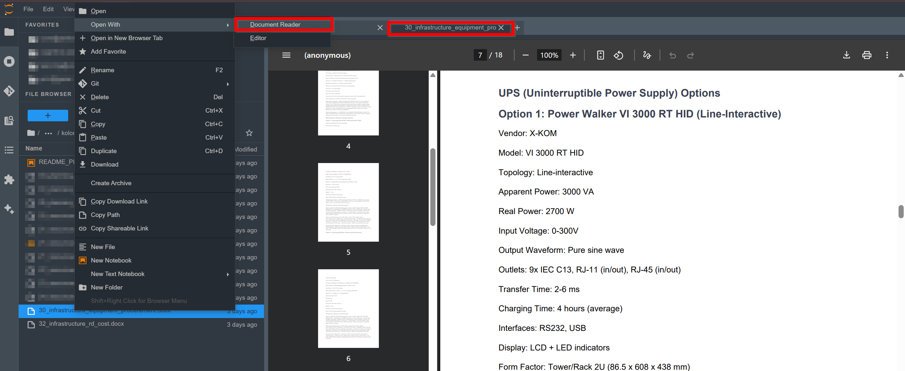

# JupyterLab Document Reader Extension

[](https://badge.fury.io/py/jupyterlab-doc-reader-extension)

A JupyterLab extension that allows viewing Microsoft Word documents (DOCX, DOC) and Rich Text Format (RTF) files directly in JupyterLab. The extension automatically converts documents to PDF on-the-fly for seamless viewing without creating persistent files.




## Features

- View DOCX, DOC, and RTF files directly in JupyterLab
- Automatic conversion to PDF for display (no temporary files created in your workspace)
- Native PDF rendering in the browser
- Read-only mode to prevent accidental modifications
- Clean, integrated interface matching JupyterLab's design

## Architecture

This extension consists of:
- **Python server extension**: Handles document-to-PDF conversion using pure Python libraries (mammoth + weasyprint)
- **TypeScript frontend extension**: Provides the document viewer widget and file type registration

## Requirements

- JupyterLab >= 4.0.0
- Python >= 3.9
- No external system dependencies required (pure Python solution)

## Install

Simply install the extension with pip:

```bash
pip install jupyterlab_doc_reader_extension
```

All required Python dependencies (mammoth, weasyprint) will be installed automatically.

## Usage

Once installed, simply click on any `.docx`, `.doc`, or `.rtf` file in the JupyterLab file browser. The extension will automatically:
1. Convert the document to PDF on the server
2. Stream the PDF to your browser
3. Display it in a dedicated viewer tab

No temporary files are created in your workspace - the conversion happens in memory on the server side.

## Uninstall

To remove the extension, execute:

```bash
pip uninstall jupyterlab_doc_reader_extension
```

## Troubleshoot

If you are seeing the frontend extension, but it is not working, check
that the server extension is enabled:

```bash
jupyter server extension list
```

If the server extension is installed and enabled, but you are not seeing
the frontend extension, check the frontend extension is installed:

```bash
jupyter labextension list
```

## Contributing

### Development install

Note: You will need NodeJS to build the extension package.

The `jlpm` command is JupyterLab's pinned version of
[yarn](https://yarnpkg.com/) that is installed with JupyterLab. You may use
`yarn` or `npm` in lieu of `jlpm` below.

```bash
# Clone the repo to your local environment
# Change directory to the jupyterlab_doc_reader_extension directory
# Install package in development mode
pip install -e ".[test]"
# Link your development version of the extension with JupyterLab
jupyter labextension develop . --overwrite
# Server extension must be manually installed in develop mode
jupyter server extension enable jupyterlab_doc_reader_extension
# Rebuild extension Typescript source after making changes
jlpm build
```

You can watch the source directory and run JupyterLab at the same time in different terminals to watch for changes in the extension's source and automatically rebuild the extension.

```bash
# Watch the source directory in one terminal, automatically rebuilding when needed
jlpm watch
# Run JupyterLab in another terminal
jupyter lab
```

With the watch command running, every saved change will immediately be built locally and available in your running JupyterLab. Refresh JupyterLab to load the change in your browser (you may need to wait several seconds for the extension to be rebuilt).

By default, the `jlpm build` command generates the source maps for this extension to make it easier to debug using the browser dev tools. To also generate source maps for the JupyterLab core extensions, you can run the following command:

```bash
jupyter lab build --minimize=False
```

### Development uninstall

```bash
# Server extension must be manually disabled in develop mode
jupyter server extension disable jupyterlab_doc_reader_extension
pip uninstall jupyterlab_doc_reader_extension
```

In development mode, you will also need to remove the symlink created by `jupyter labextension develop`
command. To find its location, you can run `jupyter labextension list` to figure out where the `labextensions`
folder is located. Then you can remove the symlink named `jupyterlab_doc_reader_extension` within that folder.

### Testing the extension

#### Server tests

This extension is using [Pytest](https://docs.pytest.org/) for Python code testing.

Install test dependencies (needed only once):

```sh
pip install -e ".[test]"
# Each time you install the Python package, you need to restore the front-end extension link
jupyter labextension develop . --overwrite
```

To execute them, run:

```sh
pytest -vv -r ap --cov jupyterlab_doc_reader_extension
```

#### Frontend tests

This extension is using [Jest](https://jestjs.io/) for JavaScript code testing.

To execute them, execute:

```sh
jlpm
jlpm test
```

#### Integration tests

This extension uses [Playwright](https://playwright.dev/docs/intro) for the integration tests (aka user level tests).
More precisely, the JupyterLab helper [Galata](https://github.com/jupyterlab/jupyterlab/tree/master/galata) is used to handle testing the extension in JupyterLab.

More information are provided within the [ui-tests](./ui-tests/README.md) README.

### Packaging the extension

See [RELEASE](RELEASE.md)
