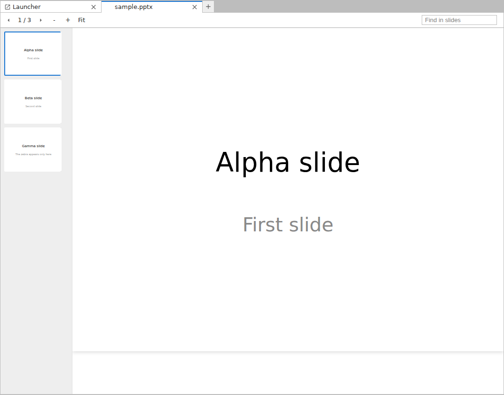
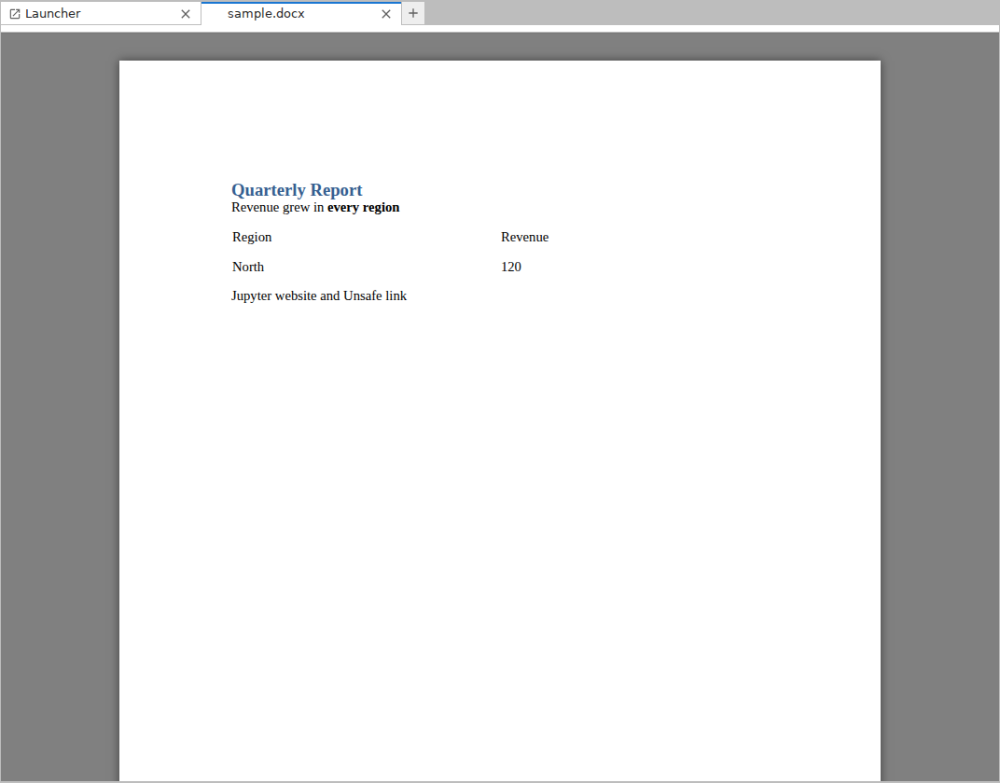

# JupyterLab Document Reader Extension

[](https://github.com/stellarshenson/jupyterlab_doc_reader_extension/actions/workflows/build.yml)
[](https://www.npmjs.com/package/jupyterlab_doc_reader_extension)
[](https://pypi.org/project/jupyterlab-doc-reader-extension/)
[](https://pepy.tech/project/jupyterlab-doc-reader-extension)
[](https://jupyterlab.readthedocs.io/en/stable/)
[](https://kolomolo.com)

> [!TIP]
> This extension is part of the [stellars_jupyterlab_extensions](https://github.com/stellarshenson/stellars_jupyterlab_extensions) metapackage. Install all Stellars extensions at once: `pip install stellars_jupyterlab_extensions`

A JupyterLab extension that displays Microsoft Word (DOCX) documents, PowerPoint (PPTX) presentations and Rich Text Format (RTF) files in JupyterLab. The browser renders each file from its bytes with an established open-source viewer library: no conversion to PDF, no LibreOffice and no server-side processing.





## Features

The extension offers exactly what each viewer library offers, and adds no feature of its own.

| Format | Viewer library                                                     | Licence    | What you get                                                                                |
| ------ | ------------------------------------------------------------------ | ---------- | ------------------------------------------------------------------------------------------- |
| DOCX   | [docx-preview](https://github.com/VolodymyrBaydalka/docxjs)        | Apache-2.0 | Pages with headers, footers, footnotes, tables, images and numbering                        |
| PPTX   | [@aiden0z/pptx-renderer](https://github.com/aiden0z/pptx-renderer) | Apache-2.0 | One slide at a time, slide thumbnails, previous and next, zoom and fit, find with highlight |
| RTF    | [rtf.js](https://github.com/tbluemel/rtf.js)                       | MIT        | Formatted text and embedded WMF or EMF pictures                                             |

- Keys in a presentation: left and right arrows, PageUp, PageDown, Home, End
- Find in a presentation: Enter for the next match, Shift+Enter for the previous one
- Links in a DOCX or RTF document: `http`, `https` and `mailto` links open in a new tab, `#` links scroll inside the document, any other link is disabled
- Read-only: files are never modified
- Each viewer library loads only when a file of its format is opened

## Caveats

- Legacy binary `.doc` and `.ppt` files have no browser renderer and show a message asking to save the file as DOCX or PPTX
- DOCX pages break only at the page and section breaks written in the file, not where Word would flow text onto a new page, so a long section shows as one tall page
- HTML that a DOCX embeds as an altChunk part is not shown, because docx-preview would run any script in it inside the JupyterLab page; a DOCX whose only content is such a part shows an empty page
- Word documents and RTF files have no zoom, page counter or table of contents, because their viewers offer none; the browser's own find (Ctrl+F) searches their text

## Requirements

- JupyterLab >= 4.6.0
- Python >= 3.9

## Install

```bash
pip install jupyterlab_doc_reader_extension
```

## Usage

Open any `.docx`, `.pptx` or `.rtf` file from the JupyterLab file browser. The document opens in a read-only viewer tab.

## Uninstall

To remove the extension, execute:

```bash
pip uninstall jupyterlab_doc_reader_extension
```

## Troubleshoot

If documents open in the text editor instead of the viewer, check that the extension is installed and enabled:

```bash
jupyter labextension list
```

## Contributing

### Development install

Note: You will need NodeJS to build the extension package.

The `jlpm` command is JupyterLab's pinned version of
[yarn](https://yarnpkg.com/) that is installed with JupyterLab. You may use
`yarn` or `npm` in lieu of `jlpm` below.

```bash
# Clone the repo to your local environment
# Change directory to the jupyterlab_doc_reader_extension directory
# Install package in development mode
pip install -e .
# Link your development version of the extension with JupyterLab
jupyter labextension develop . --overwrite
# Rebuild extension Typescript source after making changes
jlpm build
```

You can watch the source directory and run JupyterLab at the same time in different terminals to watch for changes in the extension's source and automatically rebuild the extension.

```bash
# Watch the source directory in one terminal, automatically rebuilding when needed
jlpm watch
# Run JupyterLab in another terminal
jupyter lab
```

With the watch command running, every saved change will immediately be built locally and available in your running JupyterLab. Refresh JupyterLab to load the change in your browser (you may need to wait several seconds for the extension to be rebuilt).

By default, the `jlpm build` command generates the source maps for this extension to make it easier to debug using the browser dev tools. To also generate source maps for the JupyterLab core extensions, you can run the following command:

```bash
jupyter lab build --minimize=False
```

### Development uninstall

```bash
pip uninstall jupyterlab_doc_reader_extension
```

In development mode, you will also need to remove the symlink created by `jupyter labextension develop`
command. To find its location, you can run `jupyter labextension list` to figure out where the `labextensions`
folder is located. Then you can remove the symlink named `jupyterlab_doc_reader_extension` within that folder.

### Testing the extension

#### Frontend tests

This extension is using [Jest](https://jestjs.io/) for JavaScript code testing.

To execute them, execute:

```sh
jlpm
jlpm test
```

#### Integration tests

This extension uses [Playwright](https://playwright.dev/docs/intro) for the integration tests (aka user level tests).
More precisely, the JupyterLab helper [Galata](https://github.com/jupyterlab/jupyterlab/tree/master/galata) is used to handle testing the extension in JupyterLab.

More information are provided within the [ui-tests](./ui-tests/README.md) README. The documents the tests open live in `ui-tests/tests/fixtures/`; `make_fixtures.py` there regenerates them.

### Packaging the extension

See [RELEASE](RELEASE.md)
